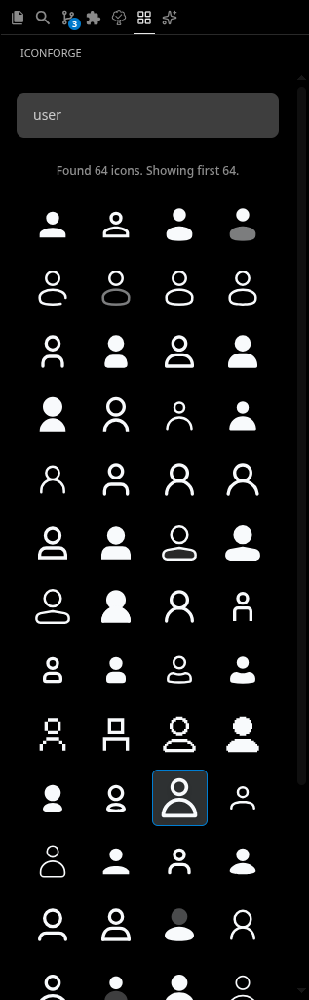
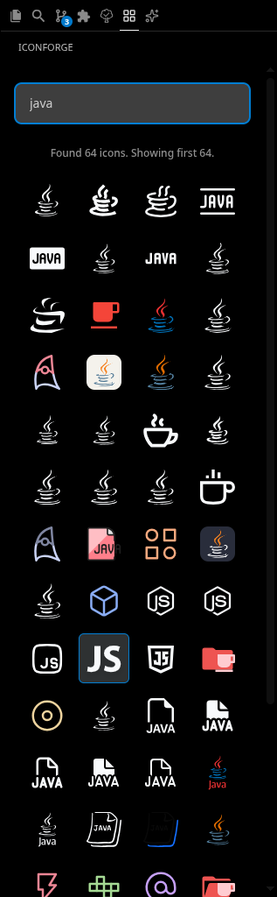
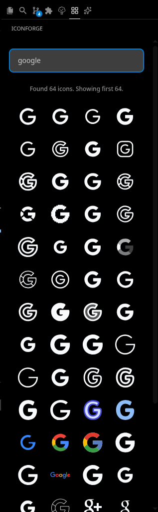
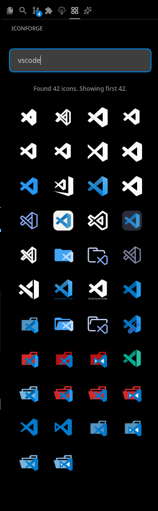
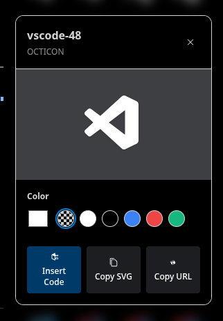
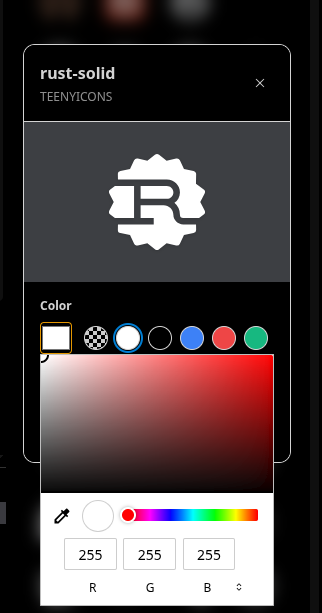

# IconForge (VS Code Extension)

**IconForge** is a fast, seamless, and powerful Visual Studio Code extension that allows you to easily search, customize, and insert thousands of premium open-source icons directly into your projects without ever leaving your editor.

## Screenshots

  
  
  
  
   
  
  

## Features

- 🔍 **Instant Search:** Find the perfect icon out of tens of thousands across major icon packs (Lucide, Material, Phosphor, FontAwesome, etc.) straight from the VS Code sidebar.
- 🎨 **Color Customization:** Easily adapt generic UI icons to fit your project entirely via a native color picker, quick-color palettes, or just relying on `currentColor`.
- ⚡ **1-Click Insert:** Place the optimized SVG snippet of any icon right at your active cursor.
- 📋 **Multiple Copy Options:** Copy the raw SVG code, or purely the direct download URL in one click for usage elsewhere.
- 🌙 **Theme Aware:** Automatically detects and respects your VS Code dark/light themes.
- 🚀 **Performant & Offline Tolerant:** Built lightweight on React/Tailwind natively integrated with VS Code’s Webview APIs. Non-intrusive memory footprint.

## Usage

1. Open the **IconForge** view from the Activity Bar (Sidebar) in VS Code.
2. Search for any term (e.g., `user`, `home`, `react`).
3. Click any icon to open its **Details Modal**.
4. _(Optional)_ Change the color via the picker.
5. Click **Insert Code** to drop the SVG at your cursor, **Copy SVG** to add the code to your clipboard, or **Copy URL**.

## Requirements

Active internet connection is needed to search and download SVGs through the public Iconify API.

## Extension Settings

No explicit configuration needed! IconForge works instantly out-of-the-box.

## Known Issues

- Please report any bugs or feature requests to our [GitHub Repository](https://github.com/codershubinc/icon-forge).

## Release Notes

### 0.0.1

Initial release of IconForge.

- Implemented core Iconify API search inside lateral sidebar.
- Built Detail Popup View featuring Insert, Copy SVG, and Copy URL mechanics.
- Integrated fully functional responsive Color Picker UI.

---

**Enjoying IconForge?** Don't forget to leave a review and star the project!
